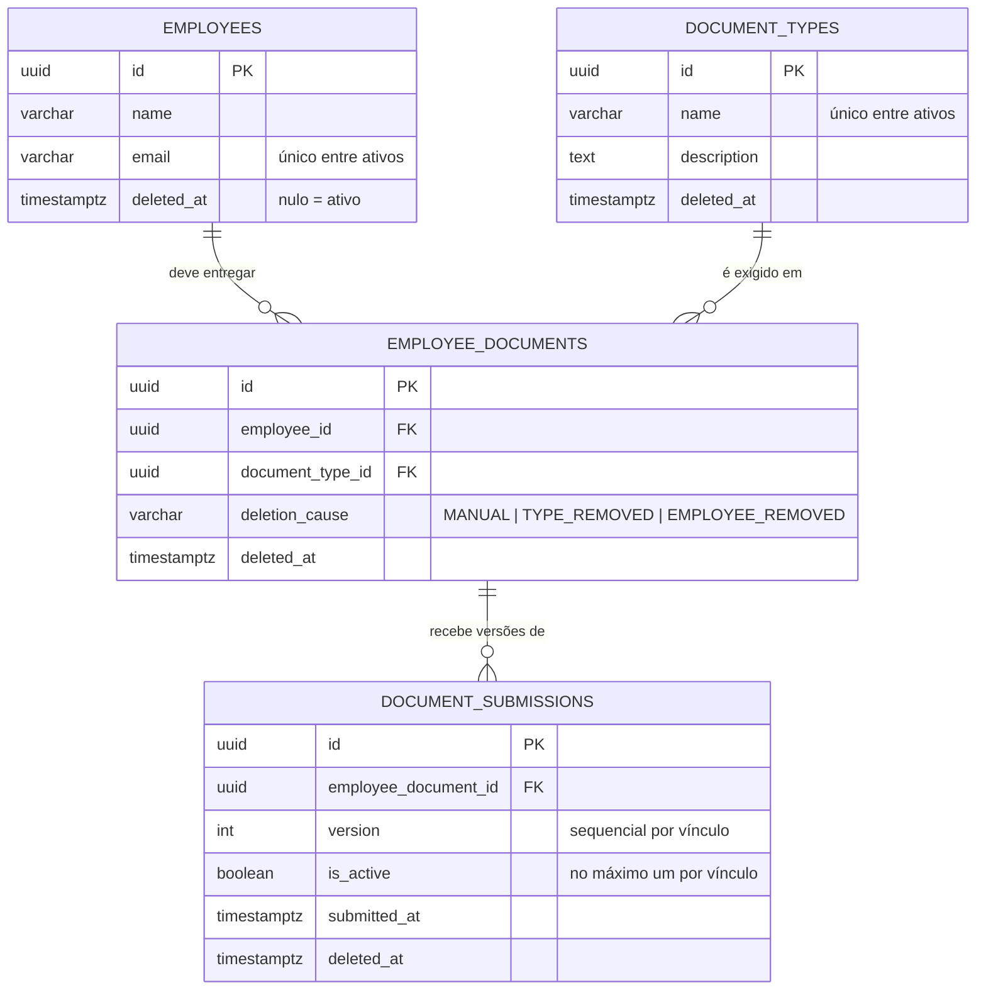

# Design

O **como**. Modelagem, arquitetura, decisões com a alternativa descartada, contratos,
estratégia de testes e rastreabilidade.

- O **que** o sistema faz está em `specs/requirements.md` (`REQ-##`).
- As **escolhas de tecnologia** e suas versões estão em `stack.md`. Este documento não as
  repete — quando cita uma ferramenta, é para explicar como ela é usada, não por que foi
  escolhida.

Este é o documento de referência das decisões do projeto — fonte única de `D-##`.

---

## 1. Modelo de dados

### 1.1 Visão geral



### 1.2 A separação que sustenta o resto

`EmployeeDocument` é **a obrigação** ("este colaborador deve entregar CPF").
`DocumentSubmission` é **o envio** — cada reenvio gera uma linha nova, versionada.

Disso decorre, sem esforço adicional:

| Conceito de REQ | Como se expressa no modelo |
|---|---|
| Pendente | Vínculo ativo **sem** submission ativa |
| Entregue | Vínculo ativo **com** submission ativa |
| Histórico | Todas as submissions do vínculo, ativas e removidas |
| Versão ativa única | Índice único parcial sobre `is_active` |
| Soft delete com histórico íntegro | Remover o vínculo não toca nas submissions |
| Estatística | Agregação sobre duas tabelas, sem estado derivado |

A alternativa — uma tabela `documents` com coluna `version` sobrescrita a cada envio —
custa menos schema e transforma cada requisito seguinte em contorno: histórico exigiria
tabela de auditoria paralela, "versão ativa" viraria convenção de aplicação, e soft delete
de colaborador apagaria a trilha do que ele havia entregue. Ver **D-01**.

### 1.3 Schema

Colunas comuns a todas as tabelas: `id uuid PK DEFAULT gen_random_uuid()`,
`created_at timestamptz NOT NULL DEFAULT now()`, `updated_at timestamptz NOT NULL DEFAULT
now()`, `deleted_at timestamptz NULL`.

`deleted_at` nulo significa ativo. Nenhuma tabela tem coluna de status booleano paralelo a
ela — ver **D-06**.

#### `employees`

| Coluna | Tipo | Nota |
|---|---|---|
| `name` | `varchar(150) NOT NULL` | |
| `email` | `varchar(255) NOT NULL` | Único **entre ativos** |

```sql
CREATE UNIQUE INDEX uq_employees_email
  ON employees (email) WHERE deleted_at IS NULL;
```

Atende REQ-01.3 e REQ-12.5: remover um colaborador libera o e-mail para novo cadastro, sem
que a linha antiga saia do banco.

#### `document_types`

| Coluna | Tipo | Nota |
|---|---|---|
| `name` | `varchar(100) NOT NULL` | Único **entre ativos** |
| `description` | `text NULL` | |

```sql
CREATE UNIQUE INDEX uq_document_types_name
  ON document_types (name) WHERE deleted_at IS NULL;
```

Atende REQ-02.3 e REQ-13.6.

#### `employee_documents` — o vínculo

| Coluna | Tipo | Nota |
|---|---|---|
| `employee_id` | `uuid NOT NULL` → `employees(id)` | |
| `document_type_id` | `uuid NOT NULL` → `document_types(id)` | |
| `deletion_cause` | `varchar(20) NULL` | `MANUAL` \| `TYPE_REMOVED` \| `EMPLOYEE_REMOVED`. Nulo enquanto ativo |

**Não existe coluna `status`.** Pendência é derivada — ver **D-03**.

```sql
CREATE UNIQUE INDEX uq_employee_document_active
  ON employee_documents (employee_id, document_type_id) WHERE deleted_at IS NULL;

CREATE INDEX idx_employee_documents_type
  ON employee_documents (document_type_id) WHERE deleted_at IS NULL;

ALTER TABLE employee_documents ADD CONSTRAINT ck_employee_documents_deletion_cause
  CHECK ((deleted_at IS NULL) = (deletion_cause IS NULL));
```

O índice único parcial atende REQ-03.6 e viabiliza REQ-05: como ele ignora linhas removidas,
re-vincular um par já desvinculado simplesmente insere uma linha nova.

O `CHECK` amarra as duas colunas: vínculo ativo não carrega causa de remoção, e vínculo
removido nunca fica sem ela. É o tipo de invariante que custa uma linha de DDL e elimina uma
classe inteira de estado inconsistente — ver **D-12**.

#### `document_submissions` — o envio

| Coluna | Tipo | Nota |
|---|---|---|
| `employee_document_id` | `uuid NOT NULL` → `employee_documents(id)` | |
| `version` | `integer NOT NULL` | Sequencial por vínculo, a partir de 1 |
| `is_active` | `boolean NOT NULL DEFAULT true` | No máximo um ativo por vínculo |
| `submitted_at` | `timestamptz NOT NULL DEFAULT now()` | REQ-06.3 |

```sql
-- Um único envio ativo por vínculo. Base de REQ-07.3 e REQ-07.5.
CREATE UNIQUE INDEX uq_submission_active
  ON document_submissions (employee_document_id)
  WHERE is_active AND deleted_at IS NULL;

-- Deliberadamente NÃO parcial. Ver nota abaixo.
CREATE UNIQUE INDEX uq_submission_version
  ON document_submissions (employee_document_id, version);

-- Suporte a REQ-18 (últimos envios), com desempate determinístico.
CREATE INDEX idx_submissions_recent
  ON document_submissions (submitted_at DESC, id DESC) WHERE deleted_at IS NULL;
```

**Por que `uq_submission_version` não é parcial.** Se ele ignorasse linhas removidas, a
versão 3 de um envio removido poderia ser reemitida, e o histórico passaria a ter dois
registros diferentes chamados "versão 3". REQ-08.4 exige o oposto: o contador **não**
reinicia e número já emitido **não** é reaproveitado. Manter o índice sobre todas as linhas
é o que garante isso no banco, e não por disciplina de código.

Consequência prática: a próxima versão é sempre
`COALESCE(MAX(version), 0) + 1` sobre **todas** as submissions do vínculo, incluindo as
removidas.

### 1.4 Pendência derivada

Não há coluna a consultar. A definição de REQ é traduzida literalmente:

```sql
-- Vínculos ativos, de colaborador ativo e tipo ativo, sem envio ativo.
SELECT ed.*
FROM employee_documents ed
JOIN employees      e  ON e.id  = ed.employee_id      AND e.deleted_at  IS NULL
JOIN document_types dt ON dt.id = ed.document_type_id AND dt.deleted_at IS NULL
WHERE ed.deleted_at IS NULL
  AND NOT EXISTS (
    SELECT 1 FROM document_submissions s
    WHERE s.employee_document_id = ed.id
      AND s.is_active
      AND s.deleted_at IS NULL
  );
```

O anti-join é servido por `uq_submission_active`: o predicado do índice parcial é exatamente
o predicado da subconsulta, e `employee_document_id` é sua coluna líder. **Nenhum índice
adicional é necessário** — a ser confirmado com `EXPLAIN` na task de listagem de pendentes.

Os três `deleted_at IS NULL` repetidos nos JOINs não são redundância: são o requisito
REQ-14.3 e REQ-14.4 escritos à mão, porque o ORM não os aplica a join manual. Ver **D-06**.

---

## 2. Arquitetura

### 2.1 Módulos

| Módulo | Responsabilidade | Não conhece |
|---|---|---|
| `employees` | Colaborador e seu ciclo de vida | Documentos |
| `document-types` | Catálogo de tipos | Colaboradores |
| `employee-documents` | **Dono do vínculo e das submissions** | — |
| `statistics` | Leitura agregada, repositórios read-only | Escrita |
| `shared` | Erros, filter, paginação, `TransactionRunner`, logger, health | Domínio |

**Regra de acoplamento.** Módulos conversam por services públicos, nunca por repositórios
alheios. Nos `exports` de cada módulo sai apenas o service; repositório não vaza.

**A exceção declarada é `statistics`**, que acessa o schema diretamente. O motivo é
concreto: compor estatística a partir dos services de outros módulos exigiria carregar
coleções e reduzi-las em memória — exatamente o que REQ-16.7 e REQ-17.5 proíbem. Ele acopla
ao schema, não aos módulos, e é read-only.

**O limite transacional é o limite do agregado.** Como `employee-documents` é dono do vínculo
e das submissions, nenhuma transação cruza módulo. As duas operações que tocam mais de um
módulo — remoção de colaborador e remoção de tipo — resolvem isso invocando o service de
`employee-documents` **dentro** da transação aberta pelo módulo chamador, passando o
`EntityManager` adiante. Ver **D-05** e **D-04**.

### 2.2 Estrutura de pastas

```
src/
├── config/
├── database/
│   ├── data-source.ts
│   ├── database.module.ts
│   └── migrations/
├── shared/
│   ├── errors/
│   ├── filters/
│   ├── pagination/
│   ├── transaction/
│   └── health/
└── modules/
    ├── employees/
    ├── document-types/
    ├── employee-documents/
    │   └── domain/
    │       ├── employee-document.entity.ts
    │       └── document-submission.entity.ts
    └── statistics/
specs/
├── requirements.md
├── design.md
└── tasks.md
test/
├── integration/
└── e2e/
```

Cada módulo de domínio segue o mesmo arranjo interno: `*.controller.ts`, `*.service.ts`,
`*.repository.ts`, `dto/`, `domain/`. Consistência entre módulos é critério de avaliação
declarado ("estilo consistente em toda a base"); um módulo organizado de forma diferente
custa atenção do revisor sem entregar nada.

`data-source.ts` fica separado da configuração do Nest porque o CLI do TypeORM o consome
fora do contexto da aplicação — ver **D-11**.

---

## 3. Decisões e trade-offs

Formato: Contexto / Decisão / Alternativa descartada / Consequência.

Numeração **estável**: D-01 a D-11 vêm das decisões travadas na abertura do projeto e
mantêm seus números — `requirements.md` já referencia D-07, e renumerar quebraria a
rastreabilidade. D-12 em diante foi decidido durante a escrita das specs.

---

### D-01 — Separar vínculo de envio

**Contexto.** REQ-06, REQ-07 e REQ-09 exigem histórico de versões com apenas a mais recente
ativa. REQ-10 exige listar pendências. REQ-14 exige que remoção preserve histórico.

**Decisão.** Quatro entidades, separando a obrigação (`EmployeeDocument`) do envio
(`DocumentSubmission`), conforme §1.2.

**Alternativa descartada.** Tabela única `documents` com `version` sobrescrito. Mais barata
de modelar e imediatamente insuficiente: não há onde guardar versão anterior, "pendente"
vira coluna nullable ambígua, e remover um colaborador destruiria a trilha do que foi
entregue — contradizendo REQ-14.6.

**Consequência.** É a decisão-mãe. Versionamento, soft delete com histórico íntegro e
estatística como agregação simples saem dela sem mecanismo adicional. Custo: uma junção a
mais em quase toda consulta.

---

### D-02 — A fonte de verdade da versão ativa é o banco

**Contexto.** REQ-07.3 exige no máximo um envio ativo por vínculo. REQ-07.5 exige que dois
reenvios concorrentes resultem em exatamente um persistido e um rejeitado com conflito.

**Decisão.** Índice único parcial `uq_submission_active` (§1.3). A garantia vive no schema.

**Alternativa descartada.** Ponteiro `current_submission_id` no vínculo — exige a mesma
transação e **não** impede dois ativos sob escrita concorrente, porque duas transações podem
ler o mesmo ponteiro antes de qualquer escrita. Também descartado lock pessimista
(`SELECT ... FOR UPDATE`) no vínculo: funcionaria, mas serializa envios por vínculo e move
para o código uma garantia que o banco dá de graça.

**Consequência.** Reenvio concorrente vira violação de unicidade (`23505`), traduzida em HTTP
409 — resolve REQ-07.3 e REQ-07.5 com um único objeto de schema, sem lock e sem fila.
`version` é inteiro sequencial por vínculo, protegido por `uq_submission_version`, o que
atende REQ-07.4 pelo mesmo mecanismo. A discriminação entre os dois índices é **D-14**.

---

### D-03 — Pendência derivada, sem estado redundante

**Contexto.** REQ-10 exige listar vínculos pendentes com filtros e paginação; REQ-16 e REQ-17
agregam sobre o mesmo conceito. "Pendente" precisa ser decidível em consulta.

**Decisão.** Pendência é **derivada**: `NOT EXISTS` de submission ativa para o vínculo (§1.4).
Não há coluna `status` nem enum `employee_document_status`.

**Alternativa descartada — e esta decisão foi revertida durante a escrita das specs.** A
decisão original era denormalizar `status` (`PENDING` / `SUBMITTED`) no vínculo, escrito
apenas dentro da transação que altera submissions, para transformar a listagem de pendentes
num `WHERE` indexado. A divergência foi levantada por mim e aceita. O que mudou entre a
decisão original e a revisão: as operações que escreveriam `status` passaram de **duas** para
**cinco** — envio, reenvio, remoção de envio ativo (REQ-08), desvínculo (REQ-04) e cascata de
remoção de tipo (REQ-13). Cada uma é um ponto de drift, num sistema cujo critério de
avaliação declarado é justamente consistência após soft delete. O ganho de performance que
justificava a denormalização não se sustenta neste volume.

**Consequência.** Um valor que pode mentir sobre pendência deixa de existir. REQ-15.4 —
coerência entre o estado do vínculo e a existência de envio ativo — passa a ser satisfeito
**por construção**: não há estado declarado que possa divergir da realidade. O teste que
antes provaria a coerência de `status` é substituído por um que prova a coerência da
listagem derivada após envio, reenvio, remoção de envio e soft delete.

Custo assumido: um anti-join por consulta de pendência, em vez de um predicado sobre coluna.
Verificado em §1.4 que `uq_submission_active` já o serve, **sem índice adicional**.

Nota de escala para o README: em volume de produção a denormalização volta a fazer sentido,
alimentada por evento ou por view materializada — não por escrita espalhada em cinco
operações.

---

### D-04 — Operações críticas

**Contexto.** REQ-15 exige que operações com múltiplas escritas relacionadas sejam atômicas.
O enunciado afirma explicitamente que **identificar quais operações são críticas faz parte do
desafio**.

**Decisão.** Quatro operações são críticas. Cada uma envolve mais de uma escrita com
invariante entre elas, e todas passam pelo `TransactionRunner` (D-05).

| # | Operação | Escritas | Invariante | REQ |
|---|---|---|---|---|
| 1 | Vinculação em lote | N inserções | Todos ou nenhum | REQ-03.2 |
| 2 | Envio / reenvio | Desativa anterior + insere nova | Nunca dois ativos, nunca buraco de versão | REQ-06, REQ-07 |
| 3 | Remoção de colaborador | Marca + propaga aos vínculos | Não deixa vínculo ativo órfão | REQ-12 |
| 4 | Remoção de tipo | Marca + propaga aos vínculos | Idem, com causa `TYPE_REMOVED` | REQ-13 |

**Não críticas, e o critério** (REQ-15.6). O critério é **escrita única de linha, sem
invariante entre registros** — nesse caso a atomicidade vem do próprio statement, e abrir
transação é cerimônia sem garantia adicional:

| Operação | Por quê |
|---|---|
| Cadastro de colaborador (REQ-01) | Inserção única |
| Cadastro de tipo (REQ-02) | Inserção única |
| Remoção de envio ativo (REQ-08) | `UPDATE` de linha única em `document_submissions` |
| Desvinculação (REQ-04) | `UPDATE` de linha única em `employee_documents`, com as duas colunas amarradas pelo `CHECK` de D-12 |

Registrar essa classificação no README conta tanto quanto a lista das críticas.

**Alternativa descartada.** Tratar toda escrita como crítica, por uniformidade. Descartado
porque apagaria a distinção que o enunciado pede para demonstrar, e porque transação
desnecessária é custo sem contrapartida.

**Classificação revisada.** A versão anterior deste documento listava **seis** operações
críticas. Remoção de envio ativo e desvinculação foram reclassificadas ao aplicar o mesmo
rigor que D-03 usou para descartar a denormalização: nos dois casos as escritas estão na mesma
linha da mesma tabela, e na desvinculação o `CHECK` de D-12 já garante por DDL que
`deleted_at` e `deletion_cause` nunca divergem. O enunciado pede **discriminação** —
superlistar demonstra tão pouco quanto sublistar.

**Consequência.** A operação 4 é a mais cara: um tipo com muitos vínculos vira N atualizações
numa transação. Aceitável neste volume; em produção viraria processamento assíncrono.
Registrar no README como nota de escala.

---

### D-05 — Propagação de transação explícita

**Contexto.** As seis operações de D-04 escrevem em mais de uma tabela, e duas delas cruzam
a fronteira entre módulos.

**Decisão.** `TransactionRunner` na camada `shared`. Repositórios recebem `EntityManager`
opcional e usam o transacional quando fornecido.

```ts
@Injectable()
export class TransactionRunner {
  constructor(private readonly dataSource: DataSource) {}
  run<T>(work: (manager: EntityManager) => Promise<T>): Promise<T> {
    return this.dataSource.transaction('READ COMMITTED', work);
  }
}
```

```ts
private repo(manager?: EntityManager): Repository<EmployeeDocument> {
  return (manager ?? this.dataSource.manager).getRepository(EmployeeDocument);
}
```

**Alternativa descartada.** `typeorm-transactional` com `AsyncLocalStorage`, que dispensaria
passar o `EntityManager` adiante. Funciona, e esconde o limite transacional de quem revisa o
código em vinte minutos — o parâmetro explícito na assinatura **é** a documentação de onde a
transação começa e termina.

**Consequência.** Assinatura de repositório mais verbosa, em troca de limite transacional
legível. `READ COMMITTED` é suficiente porque a garantia de unicidade está no índice (D-02),
não em leitura repetível. Esta decisão precisa entrar na primeira leva de tasks: adotá-la
depois da fundação significaria reescrever a assinatura de todo método de repositório.

---

### D-06 — Soft delete com filtros explícitos

**Contexto.** REQ-14 é critério de avaliação declarado e atravessa todo o sistema.

**Decisão.** Nunca deletar fisicamente; `deleted_at` via `@DeleteDateColumn`. Unicidade
convive com remoção lógica por **índice parcial** (§1.3). Filtros de remoção são escritos
**explicitamente na camada de repositório**.

**A armadilha, declarada.** O filtro automático do `@DeleteDateColumn` se aplica ao alias
principal do QueryBuilder, **mas não a joins escritos à mão**. Como quase toda consulta
relevante deste sistema tem join, cada cláusula precisa repetir:

```sql
JOIN employees e ON e.id = ed.employee_id AND e.deleted_at IS NULL
```

É por aqui que o requisito vaza sem ninguém perceber: a consulta não quebra, apenas responde
errado. Item dedicado no checklist de autorrevisão, verificado em toda consulta nova.

**Alternativa descartada.** Subscriber global do TypeORM aplicando o filtro automaticamente.
Removeria a repetição e o risco de esquecimento, ao custo de tornar o comportamento
invisível: quem lê a consulta não veria por que registros removidos não aparecem, e o
comportamento mudaria conforme o caminho de acesso. Verboso e auditável vence conciso e
mágico num projeto avaliado por revisão de código.

**Consequência.** REQ-14.3 e REQ-14.4 — vínculo cujo colaborador ou tipo foi removido some de
pendências e estatísticas mesmo sem estar marcado — são atendidos por esses JOINs, não por
propagação de estado. A propagação de D-04.5 e D-04.6 é defesa em profundidade, não a
garantia primária.

---

### D-07 — Re-vínculo cria vínculo novo

**Contexto.** REQ-05: um par colaborador × tipo previamente desvinculado pode voltar a ser
exigido.

**Decisão.** Vincular novamente cria um **vínculo novo**, com `id` novo e contagem de versões
reiniciada em 1. O vínculo anterior e suas submissions permanecem consultáveis como
histórico, sem contar para pendência nem estatística.

**Alternativa descartada.** "Reviver" o vínculo antigo, limpando `deleted_at`. Mais barato e
ambíguo: o histórico passaria a sugerir que a obrigação nunca foi interrompida, apagando o
intervalo em que o documento não era exigido.

**Consequência.** `uq_employee_document_active` sendo parcial é o que torna isso possível sem
tratamento especial — a linha removida não ocupa o slot de unicidade. REQ-05.2 (contagem
recomeçando em 1) sai de graça, porque `version` é sequencial **por vínculo** e o vínculo é
outro.

**Onde cada metade é verificada.** REQ-05.1 é provado na TASK-035, contra o índice parcial e
contra a checagem de duplicidade de `vincular`. REQ-05.2 **não** é provado ali: sair de graça
é afirmação sobre o schema, e schema sem teste é promessa. Como `document_submissions` só
nasce na TASK-037, a asserção vive na TASK-062, junto das outras duas facetas do mesmo
cenário (REQ-05.3 e REQ-05.4). O intervalo é seguro porque nada entre TASK-036 e TASK-061
toca o caminho de re-vínculo — a garantia é nova linha, nova FK, sequência vazia, não lógica
de aplicação que aquelas tasks alcancem.

---

### D-08 — Erros de domínio agnósticos de HTTP

**Contexto.** REQ-19 exige formato de erro único e estável, com código próprio por classe de
falha e sem vazamento de detalhe interno.

**Decisão.** Hierarquia herdando de `DomainError`, traduzida por um único exception filter
global. Controllers nunca lançam `HttpException`.

| Erro | HTTP | Quando |
|---|---|---|
| `EntityNotFoundError` | 404 | Recurso inexistente ou removido |
| `ValidationError` | 400 | Entrada malformada |
| `BusinessRuleError` | 422 | Regra de domínio violada |
| `DuplicatedResourceError` | 409 | Unicidade entre ativos |
| `ConcurrentSubmissionError` | 409 | Reenvio concorrente perdedor |
| não mapeado | 500 | Log com stack e `requestId` |

```jsonc
{
  "statusCode": 409,
  "error": "CONCURRENT_SUBMISSION",
  "message": "Já existe um envio ativo em processamento para este documento.",
  "requestId": "9f1c2e44-7b3a-4d18-9c2f-1a5e8b0d3c77",
  "timestamp": "2026-07-27T12:00:00.000Z"
}
```

**Formato do `requestId`.** UUID v4, gerado por `crypto.randomUUID()` — sem dependência nova.
Uma versão anterior desta seção trazia `"01J…"`, formato de ULID, sem que `stack.md` listasse
biblioteca que o produzisse: o documento contradizia a implementação já no primeiro uso.
ULID seria ordenável por tempo, o que ajuda a localizar a linha no log, mas REQ-19.3 pede
apenas um identificador que permita localizar a requisição, e o `timestamp` do próprio
payload já dá a ordenação.

**Origem do `requestId`.** Gerado em **middleware**, não no exception filter. Se nascesse no
filter, apenas respostas de erro teriam identificador, e REQ-20.3 — que exige o mesmo id em
todos os logs da requisição, inclusive nas bem-sucedidas — obrigaria a mover a geração
depois. O middleware honra `x-request-id` de entrada quando presente, para não quebrar
correlação com quem chama de fora, e ecoa o valor no cabeçalho `X-Request-Id`. O filter
apenas lê o que já está anexado à requisição.

**A sexta chave, opcional: `details`.** REQ-19.6 exige indicar **quais** campos foram
recusados na validação, e nenhuma das cinco chaves fixas carrega essa informação. Colocar os
nomes dentro de `message` obrigaria o cliente a fazer parsing de string — exatamente o que
REQ-19 diz querer evitar.

`details` está presente **apenas** em `VALIDATION_ERROR`. As cinco chaves fixas continuam
sempre presentes; o formato segue estável porque a ausência é a norma e a presença é
declarada por tipo de erro.

```jsonc
{
  "statusCode": 400,
  "error": "VALIDATION_ERROR",
  "message": "Entrada inválida.",
  "details": [
    { "field": "email", "reasons": ["email deve ser um e-mail válido"] },
    { "field": "endereco.cep", "reasons": ["cep deve ter 8 dígitos"] },
    { "field": "apelido", "reasons": ["campo não reconhecido"] }
  ],
  "requestId": "9f1c2e44-7b3a-4d18-9c2f-1a5e8b0d3c77",
  "timestamp": "2026-07-27T12:00:00.000Z"
}
```

Três regras de contrato:

- **`details` é array, não objeto indexado por campo.** Preserva a ordem em que a validação
  recusou os campos e permite o mesmo campo aparecer mais de uma vez.
- **Campo aninhado usa caminho com ponto** (`endereco.cep`). O `class-validator` devolve erro
  aninhado em árvore; o mapeamento achata para esse formato.
- **Nenhum outro tipo de erro carrega `details`** por enquanto. Contrato estreito é mais fácil
  de ampliar depois do que de restringir — uma vez que um cliente passe a ler `details` em
  erro de conflito, tirá-lo vira quebra de contrato.

**Alternativa descartada.** Lançar `HttpException` direto do service. Menos código e acopla
a regra de negócio ao protocolo: a mesma regra deixaria de ser reaproveitável fora de HTTP, e
o mapeamento ficaria espalhado em vez de centralizado em um arquivo auditável.

**Consequência.** O `requestId` do payload é o mesmo emitido nos logs (D em §5 e REQ-20.3),
o que fecha o caminho entre o erro que o cliente vê e a linha de log que o explica. Erro não
mapeado nunca vaza stack para a resposta (REQ-19.4), mas registra a stack completa
internamente (REQ-19.5).

---

### D-09 — Estatísticas

**Contexto.** REQ-16, REQ-17 e REQ-18. O enunciado deixa deliberadamente em aberto como
expor os dados, e "percentual de documentação completa" é ambíguo — **a ambiguidade é parte
do teste**.

**Decisão.** Expor as **duas** leituras válidas, nomeadas sem ambiguidade, em vez de escolher
uma em silêncio:

- `employeesFullyCompliantPercentage` — % de colaboradores com 100% dos documentos entregues
- `documentsSubmittedPercentage` — % de documentos entregues sobre o total exigido

Endpoint agregador `GET /statistics/overview`, com sub-recursos acessíveis isoladamente.

**Colaborador sem nenhum vínculo ativo é excluído do denominador** de
`employeesFullyCompliantPercentage`, e a quantidade de excluídos é informada separadamente
(REQ-16.4). Sem isso, cadastrar um colaborador novo **aumentaria** a conformidade global —
comportamento contraintuitivo numa tela de RH, e número que ninguém consegue defender.

```sql
WITH vinculo AS (
  SELECT ed.id, ed.employee_id,
         EXISTS (
           SELECT 1 FROM document_submissions s
           WHERE s.employee_document_id = ed.id
             AND s.is_active AND s.deleted_at IS NULL
         ) AS entregue
  FROM employee_documents ed
  JOIN employees      e  ON e.id  = ed.employee_id      AND e.deleted_at  IS NULL
  JOIN document_types dt ON dt.id = ed.document_type_id AND dt.deleted_at IS NULL
  WHERE ed.deleted_at IS NULL
),
por_colaborador AS (
  SELECT employee_id, bool_and(entregue) AS conforme
  FROM vinculo GROUP BY employee_id
)
SELECT
  100.0 * count(*) FILTER (WHERE entregue) / NULLIF(count(*), 0) AS documents_submitted_pct
FROM vinculo;
-- e, sobre por_colaborador:
--   100.0 * count(*) FILTER (WHERE conforme) / NULLIF(count(*), 0)
```

**Agregação sempre em SQL.** Carregar coleção para reduzir em memória é o sinal de alerta
mais óbvio possível neste desafio. **Toda divisão usa `NULLIF`** no denominador — base vazia
quebrando a demonstração é jeito bobo de perder ponto, e REQ-16.6 exige valor definido.

**Alternativa descartada.** Escolher um único percentual e documentá-lo. Mais simples, e
descarta justamente a oportunidade de mostrar que a ambiguidade foi percebida. Também
descartado cache: sem ele a consulta é sempre verdadeira, e em volume maior a evolução
correta é view materializada — registrar no README, não implementar.

**Consequência.** Os três `deleted_at IS NULL` do CTE são o que faz REQ-14.5 valer para as
três estatísticas de uma vez, já que todas derivam do mesmo `vinculo`.

---

### D-10 — Arquitetura de módulos

**Contexto.** "Modularização coerente sem acoplamento desnecessário" é critério de avaliação
declarado.

**Decisão.** Cinco módulos conforme §2.1. Comunicação por services públicos; repositório não
sai nos `exports`. `employee-documents` é dono do vínculo **e** das submissions.

**Alternativa descartada.** Módulo `submissions` separado de `employee-documents`. Daria
simetria com o modelo de dados e quebraria o agregado: envio e vínculo compartilham
invariante transacional (D-04.2), e separá-los faria a transação cruzar módulo, forçando um
dos dois a expor repositório para o outro.

**Consequência.** O limite transacional coincide com o limite do agregado. `statistics` é a
exceção declarada — acopla ao schema por leitura agregada, pelo motivo em §2.1.

---

### D-11 — Configuração de banco

**Contexto.** REQ-00.4 exige que estrutura mude apenas por migração explícita.

**Decisão.** `synchronize: false` sempre, inclusive em desenvolvimento. `migrationsRun:
false` — migrar é passo explícito. `data-source.ts` separado da configuração do Nest, para o
CLI do TypeORM.

**Alternativa descartada.** `synchronize: true` em desenvolvimento, pela conveniência de não
escrever migration durante a modelagem. Descartado porque produz divergência silenciosa entre
o schema da máquina de quem desenvolve e o de qualquer outro ambiente — e porque os índices
parciais de que este projeto depende não são gerados por sincronização.

**Consequência.** `migration:generate` **não** gera índice parcial nem constraint com
`WHERE`. Todos os índices de §1.3, e o `CHECK` de `employee_documents`, exigem
`migration:create` com SQL escrito à mão. Isso não é contorno: é a razão de a garantia
morar no banco.

---

### D-12 — `deletion_cause` distingue desvínculo de cascata

**Contexto.** REQ-12.2 e REQ-13.2 propagam remoção aos vínculos — a primeira a partir do
colaborador, a segunda a partir do tipo. REQ-04 remove um vínculo por decisão manual. Depois
da propagação, as três remoções ficam indistinguíveis.

**Decisão.** `employee_documents.deletion_cause` (`MANUAL` | `TYPE_REMOVED` |
`EMPLOYEE_REMOVED`), gravada na mesma transação que marca `deleted_at`, com `CHECK` amarrando
as duas colunas (§1.3).

**Terceiro valor, acrescentado na TASK-031.** A versão original desta decisão previa apenas
`MANUAL` e `TYPE_REMOVED`, e a cascata de remoção de colaborador não tinha valor próprio.
Reaproveitar `MANUAL` ali apagaria a distinção entre "este vínculo específico deixou de ser
exigido" e "o colaborador saiu da empresa" — que é exatamente o que a decisão existe para
preservar. `EMPLOYEE_REMOVED` é simétrico a `TYPE_REMOVED`: um valor por gatilho de cascata.
Não exigiu migration, porque a coluna é `varchar(20)` sem `CHECK` de enum — a restrição de
valores vive na união de tipos do TypeScript, e o `CHECK` do banco cuida apenas do que
importa para a integridade, que é a amarração com `deleted_at`.

**Alternativa descartada.** Não registrar a causa. Mais simples e destrói informação de forma
irreversível: uma eventual restauração do tipo teria de escolher entre ressuscitar
desvínculos deliberados ou perder vínculos legítimos, sem meio de distingui-los. Como a
coluna precisa existir **antes** da remoção acontecer, adicioná-la depois exigiria migração de
dados sobre informação que já não existe.

**Consequência.** A restauração seletiva fica possível (`WHERE deletion_cause =
'TYPE_REMOVED'`) sem estar implementada — está registrada como fora de escopo em
`requirements.md`. O custo hoje é uma coluna e uma constraint.

---

### D-13 — Remoção de envio sem reativação

**Contexto.** O enunciado diz que "colaboradores e **documentos** não podem ser removidos
fisicamente". "Documentos" admite duas leituras: o vínculo ou o envio. REQ-08 atende as duas.

**Decisão.** Remover o envio ativo marca `deleted_at` **e** `is_active = false`, com o que o
vínculo volta a ser **lido** como pendente — não há escrita no vínculo, apenas deixa de haver
submission ativa para o `NOT EXISTS` encontrar. **Nenhuma versão anterior é reativada.** O
contador de versão
não reinicia: o próximo envio continua em `MAX(version) + 1`.

**Alternativa descartada — reativar a versão anterior.** Parece prestativo e fabrica intenção
que o usuário não expressou: o sistema não tem como saber se a versão anterior voltou a ser
válida. Deixar o vínculo pendente é o estado honesto.

**Alternativa descartada — não implementar a operação.** Satisfaria apenas a leitura de
"documento = vínculo". O risco é assimétrico: implementar custa uma operação a mais,
não implementar arrisca não atender um requisito declarado do enunciado.

**Consequência.** O estado "vínculo pendente **com** histórico de envios" é válido e
esperado. Ele aparece normalmente na listagem de pendentes e nas estatísticas, e **não** é
caso especial em consulta alguma — o `NOT EXISTS` de §1.4 já o trata corretamente, porque
pergunta por envio *ativo*, não por existência de envio. Marcar `is_active = false` além de
`deleted_at` é redundante para o índice parcial, mas evita uma linha removida que ainda se
declara ativa no histórico (REQ-08.3).

---

### D-14 — Discriminação de `23505` por nome de constraint

**Contexto.** D-02 cria dois índices únicos sobre `document_submissions`. Ambos violam com o
mesmo `SQLSTATE 23505`, e D-08 exige código de erro próprio por classe de falha.

**Decisão.** O tratamento lê o campo `constraint` do erro do driver e discrimina:
`uq_submission_active` → `ConcurrentSubmissionError`; `uq_submission_version` → conflito de
versão. Unicidades de `employees` e `document_types` → `DuplicatedResourceError`.

**Alternativa descartada.** Mapear todo `23505` para 409 genérico. Uma linha de código a
menos e perde informação diagnóstica exatamente no caminho mais difícil de reproduzir: um
bug no cálculo de versão apareceria disfarçado de erro de concorrência, e a investigação
começaria pelo lugar errado.

**Consequência.** O mapeamento fica em um ponto único, junto do exception filter, e é
verificável por teste — o teste de reenvio concorrente passa a asseverar *qual* conflito
ocorreu, não apenas que houve um 409.

---

### D-15 — Paginação por offset

**Contexto.** REQ-11. Em particular REQ-11.5 (informar o total de itens) e REQ-11.7
(ordenação determinística, sem item repetido ou omitido entre páginas).

**Decisão.** `page` + `limit` com offset, `limit` padrão e teto documentados, resposta
carregando os itens e o total. Toda listagem ordena por chave estável com desempate por `id`.

**Alternativa descartada.** Paginação por cursor. É superior sob inserção concorrente e evita
o custo de `OFFSET` crescente, mas não entrega barato o total exigido por REQ-11.5 — obtê-lo
demandaria uma contagem separada, anulando a vantagem. Sem ganho neste volume.

**Consequência.** O total é contado sob os mesmos filtros de remoção da consulta principal
(REQ-11.8), o que significa que a contagem repete os JOINs com `deleted_at IS NULL` de D-06 —
mais um ponto onde o vazamento de soft delete é possível, e mais um item de checklist. O
desempate por `id` é o que impede que dois itens com o mesmo `submitted_at` troquem de
posição entre páginas.

---

### D-16 — Contratos de rota por posse do agregado

**Contexto.** D-10 estabelece que `employee-documents` é dono das submissions. As rotas
precisam refletir isso, ou a estrutura de URL contradiz a de módulos.

**Decisão.** Submissions são aninhadas sob o vínculo que as possui:
`/employee-documents/:id/submissions`. Não existe rota `/submissions` de primeiro nível.
Vinculação em lote é `POST /employee-documents` com o lote no corpo.

**Alternativa descartada.** `/submissions` no primeiro nível, com `employeeDocumentId` no
corpo. Mais curto e desliga a URL da posse: convidaria a criar submission sem passar pelo
agregado, que é exatamente o que D-10 proíbe.

**Consequência.** Toda submission é alcançada por um caminho que já identifica o vínculo, o
que torna impossível operar sobre ela sem resolver o vínculo antes — a checagem de vínculo
removido (REQ-06.4) fica no caminho natural, não como validação adicional que alguém pode
esquecer.

---

## 4. Contratos de API

Entrada e saída em JSON. Nenhuma rota exige autenticação (fora de escopo por decisão do
enunciado). Documentação gerada a partir dos DTOs — ver `stack.md`.

### 4.1 Colaboradores

| Método | Rota | Descrição | REQ |
|---|---|---|---|
| `POST` | `/employees` | Cadastra colaborador | REQ-01.1 |
| `GET` | `/employees` | Lista ativos, paginado | REQ-01.6, REQ-11 |
| `GET` | `/employees/:id` | Consulta por id | REQ-01.4 |
| `PATCH` | `/employees/:id` | Atualiza dados | REQ-01.5 |
| `DELETE` | `/employees/:id` | Remoção lógica com propagação | REQ-12 |

### 4.2 Tipos de documento

| Método | Rota | Descrição | REQ |
|---|---|---|---|
| `POST` | `/document-types` | Cadastra tipo | REQ-02.1 |
| `GET` | `/document-types` | Lista ativos, paginado | REQ-02.4, REQ-11 |
| `GET` | `/document-types/:id` | Consulta por id | REQ-02.5 |
| `DELETE` | `/document-types/:id` | Remoção lógica com cascata | REQ-13 |

### 4.3 Vínculos e envios

| Método | Rota | Descrição | REQ |
|---|---|---|---|
| `POST` | `/employee-documents` | Vinculação em lote | REQ-03 |
| `GET` | `/employee-documents/pending` | Pendentes, com filtros e paginação | REQ-10, REQ-11 |
| `DELETE` | `/employee-documents/:id` | Desvinculação | REQ-04 |
| `POST` | `/employee-documents/:id/submissions` | Envio ou reenvio | REQ-06, REQ-07 |
| `GET` | `/employee-documents/:id/submissions` | Histórico de versões | REQ-09 |
| `DELETE` | `/employee-documents/:id/submissions/active` | Remove o envio ativo | REQ-08 |

```jsonc
// POST /employee-documents
{ "employeeId": "…", "documentTypeIds": ["…", "…"] }

// GET /employee-documents/pending?employeeId=…&documentTypeId=…&page=1&limit=20
{
  "items": [
    { "id": "…", "employee": { "id": "…", "name": "…" },
      "documentType": { "id": "…", "name": "CPF" } }
  ],
  "total": 137, "page": 1, "limit": 20
}

// GET /employee-documents/:id/submissions
{
  "items": [
    { "id": "…", "version": 2, "isActive": true,  "submittedAt": "…" },
    { "id": "…", "version": 1, "isActive": false, "submittedAt": "…" }
  ],
  "total": 2, "page": 1, "limit": 20
}
```

A rota de histórico permanece acessível para vínculo, colaborador ou tipo removidos
(REQ-09.4, REQ-09.5, REQ-14.6). É a exceção explícita a REQ-14.2, e a única.

### 4.4 Estatísticas

| Método | Rota | Descrição | REQ |
|---|---|---|---|
| `GET` | `/statistics/overview` | Agregador | REQ-16 |
| `GET` | `/statistics/pending-types` | Tipos mais pendentes | REQ-17 |
| `GET` | `/statistics/latest-submissions` | Últimos envios | REQ-18 |

```jsonc
// GET /statistics/overview
{
  "employeesFullyCompliantPercentage": 62.5,
  "documentsSubmittedPercentage": 81.3,
  "employeesWithoutRequirements": 4,
  "totals": { "activeEmployees": 20, "activeRequirements": 75, "submitted": 61 }
}
```

`employeesWithoutRequirements` é o que torna `employeesFullyCompliantPercentage`
interpretável — sem ele, o leitor não sabe sobre qual base os 62,5% incidem (REQ-16.4).

### 4.5 Operação

| Método | Rota | Descrição | REQ |
|---|---|---|---|
| `GET` | `/health` | Estado do serviço e da conexão com o banco | REQ-00.1, REQ-00.2 |

### 4.6 Catálogo de erros

Formato de resposta e mapeamento em **D-08**. Códigos usados: `NOT_FOUND`,
`VALIDATION_ERROR`, `BUSINESS_RULE_VIOLATION`, `DUPLICATED_RESOURCE`,
`CONCURRENT_SUBMISSION`, `INTERNAL_ERROR`.

---

## 5. Estratégia de testes

As ferramentas e a justificativa de cada uma estão em `stack.md`. Aqui fica **o que cada
camada cobre**.

| Camada | Cobre | Não cobre |
|---|---|---|
| Jest (unit) | Regra de domínio pura, mapeamento de erro, cálculo de versão | Qualquer coisa que toque o banco |
| Jest + Testcontainers | Repositórios, transações, concorrência, soft delete em JOIN, índices parciais | Contrato HTTP |
| Playwright (E2E) | Fluxo completo via HTTP contra o `docker-compose` | Estado interno das tabelas, rollback |

Playwright cobre contrato e fluxo ponta a ponta — vincular, enviar, reenviar, consultar
histórico, remover, conferir estatística. O que ele **não** alcança é inspeção do estado
interno das tabelas e rollback de transação: isso exige acesso direto ao `DataSource` e fica
em Jest + Testcontainers.

### Testes que carregam o peso da avaliação

Nenhum destes é opcional. Cada um prova um critério que o enunciado destaca:

1. **Reenvios simultâneos com `Promise.all`** — exatamente uma submission ativa, `version`
   sem buraco, e um 409 identificando `CONCURRENT_SUBMISSION` e não outro conflito (D-14).
   Prova REQ-07.5 e REQ-07.6.
2. **Rollback do vínculo em lote** — falha no meio não deixa vínculo parcial. Prova REQ-03.2
   e REQ-15.2.
3. **Soft delete refletido** — colaborador removido some de pendentes e do denominador das
   duas estatísticas. Prova REQ-12, REQ-14.3 e REQ-16.5.
4. **Coerência da pendência derivada** — após envio, reenvio, remoção de envio e soft delete,
   a listagem de pendentes reflete exatamente o estado real das submissions.
   Prova REQ-15.4.

O teste 4 substitui o que, sob a decisão original de D-03, teria sido um teste de coerência
da coluna `status`. Com pendência derivada não há valor persistido a divergir; o que resta a
provar é que a consulta responde certo em cada transição de estado — inclusive na que D-13
introduz, o vínculo pendente com histórico.

Testes adicionais de invariante, um por task, conforme `tasks.md`: unicidade de e-mail entre
ativos após remoção, re-vínculo após desvínculo, cascata de remoção de tipo com
`deletion_cause`, e não reaproveitamento de número de versão após remoção de envio.

---

## 6. Rastreabilidade

| REQ | Título | Atendido em |
|---|---|---|
| REQ-00 | Disponibilidade e preparo do serviço | §4.5, D-11 |
| REQ-01 | Cadastro de colaboradores | §1.3 `employees`, §4.1 |
| REQ-02 | Cadastro de tipos de documento | §1.3 `document_types`, §4.2 |
| REQ-03 | Vinculação a tipos de documento | §1.3 `employee_documents`, D-04.1, §4.3 |
| REQ-04 | Desvinculação | D-04.4, D-12, §4.3 |
| REQ-05 | Re-vínculo após desvinculação | D-07, §1.3 `uq_employee_document_active` |
| REQ-06 | Envio de documento | D-01, D-04.2, §4.3 |
| REQ-07 | Reenvio com versionamento e histórico | D-02, D-14, §1.3 `document_submissions` |
| REQ-08 | Remoção de envio | D-13, D-04.3, §1.3 `uq_submission_version` |
| REQ-09 | Consulta do histórico de versões | §4.3, D-01 |
| REQ-10 | Listagem de pendentes com filtros | §1.4, D-03, §4.3 |
| REQ-11 | Paginação | D-15 |
| REQ-12 | Remoção de colaborador | D-04.5, D-06, §1.3 `uq_employees_email` |
| REQ-13 | Remoção de tipo de documento | D-04.6, D-12, §1.3 `uq_document_types_name` |
| REQ-14 | Soft delete refletido em todas as consultas | D-06, §1.4, D-09 |
| REQ-15 | Atomicidade das operações críticas | D-04, D-05 |
| REQ-16 | Estatística: conformidade global | D-09, §4.4 |
| REQ-17 | Estatística: tipos mais pendentes | D-09, §1.3 `idx_employee_documents_type` |
| REQ-18 | Estatística: últimos envios | D-09, §1.3 `idx_submissions_recent` |
| REQ-19 | Tratamento de erros | D-08, D-14, §4.6 |
| REQ-20 | Observabilidade | D-08 (`requestId` compartilhado), §4.5 |

**Nota sobre REQ-15.4.** O critério exige coerência entre o estado do vínculo e a existência
de envio ativo. Com D-03 revertida, ele passa a ser satisfeito **por construção**: não existe
estado declarado que possa divergir da realidade, porque pendência é lida das submissions a
cada consulta. O critério continua verificável — o teste 4 de §5 o prova —, mas o que se
prova mudou: não que uma coluna foi mantida em dia, e sim que a consulta responde
corretamente em cada transição.

Nenhum `REQ-##` está órfão. Requisitos declarados fora de escopo em `requirements.md`
(autenticação, upload, restauração, notificação, cache, auditoria de cadastro) não aparecem
nesta tabela por não terem sido admitidos como requisito.
